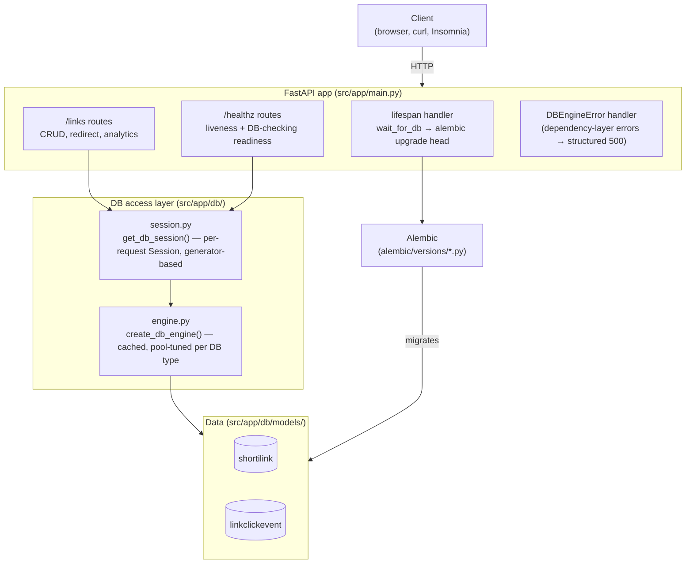

# Overview — High-Level Design

## What this service is

Shorties is a URL shortener: submit a long URL, get back a short, unique key that redirects to
it. On top of that baseline, it also tracks **hit counts and per-visit click analytics** (referrer,
user agent, timestamp) and supports **soft deletes** — a deleted link is hidden, not destroyed,
and recoverable.

That combination — shortening + analytics + soft delete — is deliberate: it's what makes this a
"real service" rather than a toy CRUD app, and it's the reason the data model has more than the
four columns a naive shortener would need (see [`02-data-model.md`](02-data-model.md)).

## The stack, and why each piece is there

| Layer | Choice | Why |
|---|---|---|
| Web framework | **FastAPI** | Async-native, generates OpenAPI/Swagger docs from the code itself (no separate spec to keep in sync), and its dependency-injection system (`Depends`) is what makes the DB session lifecycle work cleanly — see [`04-request-lifecycle.md`](04-request-lifecycle.md). |
| ORM / schema | **SQLModel** | A thin layer over SQLAlchemy + Pydantic — the same class doubles as the DB table definition *and* (optionally) the API schema shape. In practice this project keeps them separate (`db/models/models.py` vs `schemas/schemas.py`) because the DB shape and the API's public contract have different lifecycles — a column can be internal without being exposed, see decision [`0002`](../decisions/0002-links-crud-analytics-soft-delete.md). |
| Validation | **Pydantic v2** | FastAPI's request/response validation is Pydantic-native; `AnyHttpUrl` on the link-submission schema rejects malformed URLs before they ever reach the database. |
| Migrations | **Alembic** | Versioned, reviewable schema changes instead of `SQLModel.metadata.create_all()`, which can only create new tables — it silently no-ops on a column added to an existing table. This gap caused a real production-shaped bug; see decision [`0006`](../decisions/0006-alembic-migrations.md). |
| Database | **SQLite (dev) → Postgres (target)** | See decision [`0010`](../decisions/0010-why-postgres-over-sqlite.md) for the full reasoning — short version: SQLite is fine for a single process on a laptop, and actively wrong for anything with concurrent writers or that needs to survive a container restart. |
| Config | **pydantic-settings** | One `Settings` object, loaded once, validated at boot — see decision [`0004`](../decisions/0004-centralized-config.md). |
| Logging | **stdlib `logging` + a custom JSON formatter** | Structured lines to stdout (what a container platform's log aggregator reads) *and* a local rotating file (for `tail`/`grep` during development) — see decision [`0005`](../decisions/0005-structured-logging.md). |
| Dependency/tooling | **Poetry, ruff, mypy, pytest, pre-commit** | Standard modern Python tooling; `make precommit-all` is the single gate that runs all of it. |

## The shape of the system



**Request flow, one level down:** every route that touches the DB declares
`session: Annotated[Session, Depends(get_db_session)]`. FastAPI resolves that dependency *before*
the route body runs, which is why a DB-layer failure (e.g. the engine is unavailable) needs its
own exception handler at the app level — a route's own `try/except` never gets a chance to run.
See [`04-request-lifecycle.md`](04-request-lifecycle.md) for the full trace.

## Current state vs. target state

This matters for an interview answer, because "what does it run on today" and "what's it designed
to run on" are different questions right now, on purpose (staged rollout, not indecision):

| | Today | Target |
|---|---|---|
| Database | SQLite (file or in-memory, depending on env) | Postgres — pooling, migrations, and a DB-checking readiness probe are already built and verified against a real Postgres instance; only the *default* hasn't flipped yet |
| Runtime | Local process (`poetry run uvicorn` / `make run`) | Docker container, `docker compose` locally, deployed on Render |
| Deploy | Manual | `render.yaml` (infra as code), auto-deploy on push |
| Auth | None — every endpoint is open | API-key auth on write endpoints, planned |

The full phased plan (what's done, what's next, and why the phases are ordered the way they are)
lives in the roadmap artifact from the engineering review — ask me to pull it up, or see the
`decisions/` log for the granular story of what's shipped so far.

## Repo layout

```
src/app/
├── main.py                — FastAPI app, lifespan (migrations + DB wait), routers, exception handler
├── alnumgen.py             — short-key generation (secrets.choice, not random — see 0002)
├── constants.py            — KEY_MIN / KEY_MAX for key length
├── api/routes/
│   ├── healthz.py          — liveness (/) and readiness (/ready)
│   └── links.py            — CRUD + /visit (redirect) + /analytics
├── core/
│   ├── config.py           — Settings (pydantic-settings)
│   └── logging.py          — JSONFormatter + configure_logging()
├── db/
│   ├── db.py                — db_engine_factory() (raw SQLAlchemy engine construction)
│   ├── engine.py             — create_db_engine() (cached, pool config per DB type) + wait_for_db()
│   ├── session.py            — get_db_session() (per-request Session dependency)
│   ├── db_exceptions.py      — DatabaseError hierarchy
│   └── models/models.py      — ShortiLink, LinkClickEvent (SQLModel table classes)
└── schemas/schemas.py        — Pydantic request/response models (the public API shape)

alembic/
├── env.py                    — reads DB URL from Settings, SQLite batch mode
└── versions/                 — 0001 (baseline), 0002 (analytics + soft delete)

tests/                        — pytest, isolated in-memory engine per test module
docs/                         — this folder
```
