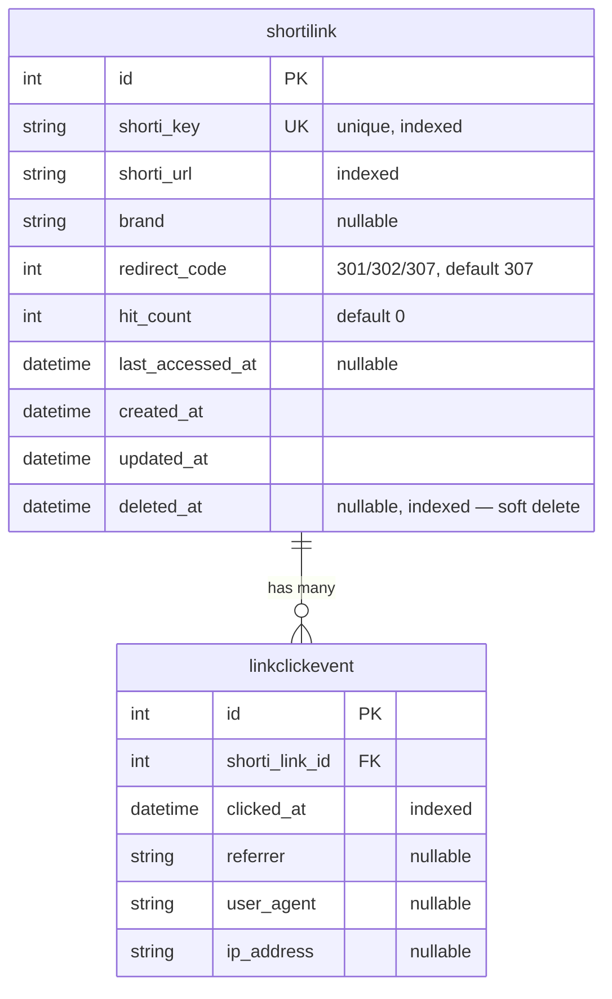

# Data Model — Low-Level Design

Source of truth: [`src/app/db/models/models.py`](../../src/app/db/models/models.py). This doc
explains *why* each field is shaped the way it is — the kind of detail that's easy to forget once
the code just works.

## Entity relationship



## `shortilink`

```python
class ShortiLink(SQLModel, table=True):
    id: int | None = Field(default=None, primary_key=True)
    shorti_key: str = Field(index=True, unique=True)
    shorti_url: str = Field(index=True)
    brand: str | None = Field(default=None)
    redirect_code: int = Field(default=307)

    # Analytics
    hit_count: int = Field(default=0)
    last_accessed_at: datetime | None = Field(default=None)

    # Record lifecycle
    created_at: datetime = Field(default_factory=utcnow)
    updated_at: datetime = Field(default_factory=utcnow)
    deleted_at: datetime | None = Field(default=None, index=True)

    @property
    def is_deleted(self) -> bool:
        return self.deleted_at is not None
```

Field-by-field rationale:

- **`shorti_key: str, unique, indexed`** — the short code itself (e.g. `abc123`). Unique because
  it's the lookup key for every read/redirect; indexed because `GET /links/{key}` and
  `GET /links/{key}/visit` are the hottest read paths in the system by design (a redirect service
  lives or dies on lookup speed).
- **`shorti_url: str, indexed`** — indexed even though it's not a primary lookup key, in case a
  future feature needs "has this URL already been shortened" (dedup) or reverse lookup by target.
- **`redirect_code: int, default 307`** — **307 (Temporary Redirect)**, not 301/302, is the
  default because it's the only one of the three that guarantees the HTTP method and body are
  preserved on redirect. 301/302 have historically been re-interpreted by some clients as "convert
  to GET" even for a POST — 307 removes that ambiguity. It's still per-link configurable
  (`Literal[301, 302, 307]` in the request schema) because a genuinely permanent redirect (301) is
  sometimes the right choice for SEO purposes on a specific link.
- **`hit_count: int, default 0`** — a denormalized counter, incremented on every `/visit`. It's
  redundant with `COUNT(*) FROM linkclickevent WHERE shorti_link_id = ...` — kept anyway because a
  redirect is the hottest path in the whole service, and a single integer increment is cheaper than
  a `COUNT()` aggregate every time someone wants "how popular is this link" without pulling up the
  full analytics endpoint.
- **`last_accessed_at: datetime | None`** — separate from `hit_count` for the same reason:
  answering "when was this last used" without touching `linkclickevent` at all.
- **`created_at` / `updated_at`** — standard record-lifecycle timestamps, set via
  `default_factory=utcnow` on insert; `updated_at` is set explicitly on every mutating route
  (`update_link`, `delete_link`) rather than relying on a DB-level trigger, so the *application*
  always knows exactly when it last touched a row.
- **`deleted_at: datetime | None, indexed`** — the soft-delete marker. Indexed because
  **every** read query filters on `deleted_at IS NULL` by default (see
  [`03-api-reference.md`](03-api-reference.md)) — that predicate runs on effectively every request,
  so it needs to be fast.

```python
def utcnow() -> datetime:
    return datetime.now(timezone.utc)
```

Timestamps are timezone-aware UTC, not naive `datetime.now()` — naive datetimes are a classic
source of silent bugs the moment a service crosses a timezone boundary (which "deployed on Render,
developed on a laptop in a different timezone" already is).

## `linkclickevent`

```python
class LinkClickEvent(SQLModel, table=True):
    """One row per recorded visit to a short link, for per-click analytics."""

    id: int | None = Field(default=None, primary_key=True)
    shorti_link_id: int = Field(foreign_key="shortilink.id", index=True)
    clicked_at: datetime = Field(default_factory=utcnow, index=True)
    referrer: str | None = Field(default=None)
    user_agent: str | None = Field(default=None)
    ip_address: str | None = Field(default=None)
```

This is the append-only event log behind `hit_count`/`last_accessed_at` — one row per `/visit`
call, never updated or deleted. `shorti_link_id` is indexed because
`GET /links/{key}/analytics` filters and sorts by it (`WHERE shorti_link_id = ? ORDER BY
clicked_at DESC LIMIT 20`); `clicked_at` is indexed for the same query's `ORDER BY`.

`referrer` / `user_agent` / `ip_address` are all nullable — a request might not send a `Referer`
header at all, and the fields are captured on a best-effort basis rather than required.

## Why two tables instead of one

A tempting simplification would be to just bump `hit_count` and skip the event log entirely. The
reason both exist: `hit_count` answers "how many," `linkclickevent` answers "who, from where, when,
exactly" — the second question is what makes this "analytics" rather than just "a counter," and
it's not reconstructable after the fact if it isn't captured at the time of the visit. See decision
[`0002`](../decisions/0002-links-crud-analytics-soft-delete.md) for the fuller reasoning and the
user decisions (redirect endpoint, soft-delete visibility, full event log vs. counter-only) that
shaped this.

## What's deliberately *not* modeled yet

- **No `owner_id` / user association** — every link is globally visible and mutable by anyone who
  knows the key (or nobody, for list/create). There's no multi-tenancy. This is a known, explicit
  gap tracked for the auth/hardening phase, not an oversight.
- **No expiration (`expires_at`)** — links don't expire. Soft delete is manual only.
- **No migration for a `hit_count` "cold path" (materialized view, rollup table)** — at current
  scale a live `COUNT`/denormalized-counter split is enough; a rollup table would be premature.
